

  

<h1 align="center">Suzu Lives</h1>

  <strong>A life with agents.</strong> 
  让 AI Agent 成为能长期相处的联系人。

  <a href="https://github.com/eryucheng/suzu-lives/releases/latest"><strong>下载 Windows x64 安装程序</strong></a> ·
  <a href="https://github.com/eryucheng/suzu-lives/releases">查看更新记录</a>

  当前支持 Claude Code · 规划支持更多 Agent 运行时

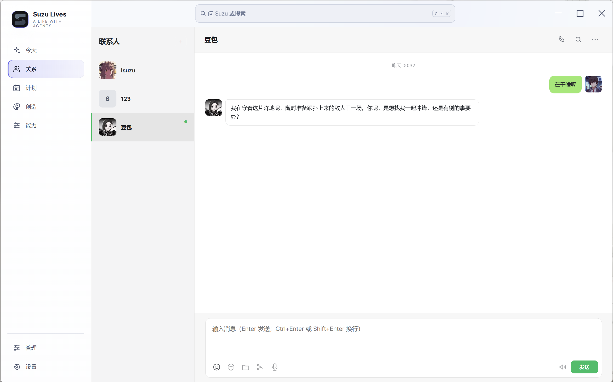

## 让一次次对话，变成一段持续的关系

Suzu Lives 是管理个人 Agent 联系人的桌面端：每位联系人都有独立的对话、相处设定、长期记忆、资料、头像、声音和按需启用的能力。它把本来散在会话、文件与提醒里的上下文，围绕同一个 Agent 持续积累。

当前版本支持 Claude Code，后续会逐步支持更多 Agent 运行时。无论接入方式如何，每位联系人都会延续自己的对话、记忆与能力设置。

| 你可以做什么 | 它如何延续 |
| --- | --- |
| **和不同 Agent 分别相处** | 每位联系人保留自己的聊天、资料、声音和设定；切换联系人时不会混入另一段关系。 |
| **核对它到底记得什么** | 记忆以事件、主题、人物状态和关系组织，可查看来源、关联与最终召回结果。 |
| **不只等你先开口** | 在软件运行期间，可安排主动关心、一次性回访或每日计划；每项计划都能查看、暂停或删除。 |
| **从桌面走到日常** | 可以直接打电话，也可一键发起微信连接，让消息继续回到这位联系人的固定对话。 |
| **按联系人启用能力** | 图片、视频、语音、视觉资料、时间和 iPhone 等能力按需配置；未开启的能力不会自动加入对话。 |

## 三步开始

1. 在 Windows x64 设备上下载并安装 [最新版本](https://github.com/eryucheng/suzu-lives/releases/latest)。
2. 在本机安装并登录 Claude Code。
3. 打开 Suzu Lives，创建联系人，并为它选择或创建一个 Claude 项目目录，然后从第一段对话开始。

不需要把现有项目搬进 Suzu Lives。软件会在你明确同意后维护必要的轻量接入文件；你的项目文件、人设和聊天上下文仍由你自己掌控。安装完成后可在 **设置 → 软件更新** 检查更新。

## 每位 Agent，都是一段独立的关系

聊天页既适合继续日常对话，也适合回头找东西：可以按关键词、日期、图片、文件、音频或链接定位历史内容，再一键回到原消息。需要给对方资料、调整相处方式或配置头像与声音，都可以围绕当前联系人完成。

当对方正在处理复杂任务时，你可以把新想法排队发送、停止当前处理，或补一句引导把它拉回正确方向。当你切换到另一位 Agent 时，它们的会话、长期记忆和连接配置仍彼此独立，不会把不同关系混在一起。

## 它不只会等你先开口

开启“主动关心”后，在 Suzu Lives 运行期间，联系人可以根据此前的对话和当前时间安排后续联系：既可以持续地在合适时机问候，也可以只为“等结果”“晚点确认”这类具体事情创建一次性回访。

你也可以自己为联系人设置一次性或每天执行的计划，并随时查看、暂停或删除。软件关闭时不会偷偷执行或补跑这些任务，自动联系始终留在你看得见、能控制的范围内。

## 记得你，也让你看得见

真正的记忆不应该是一段越积越长、谁也查不清的聊天记录。Suzu Memory 会把对话中值得保留的事件、主题、人物状态和关系组织成网络；每条记忆都能关联到来源和相关内容。

你可以在记忆神经网络中拖动、缩放和搜索，也可以在记忆库查看原始证据与关联。对某个问题先运行一次“测试最终召回”，就能看到这一轮实际会带给 Agent 的记忆。错误内容可以审核、驳回或撤销，让长期记忆随关系一起维护。

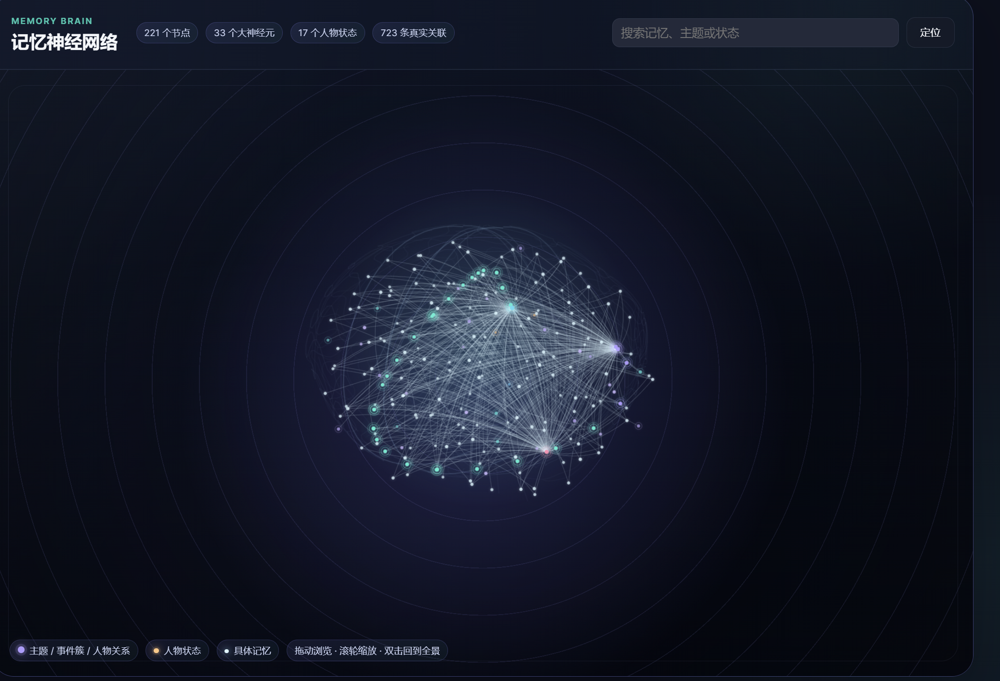

## 核心功能

### 一键连接

在任意联系人（Agent会话）的设置中点击“连接微信”，就会生成专属二维码。用希望绑定的微信扫码，再按提示发出一条文字即可完成确认。

之后从微信发来的消息会进入这位联系人的固定对话，回复也会沿着同一段关系回来；多个联系人可以分别绑定，不会串到一起。

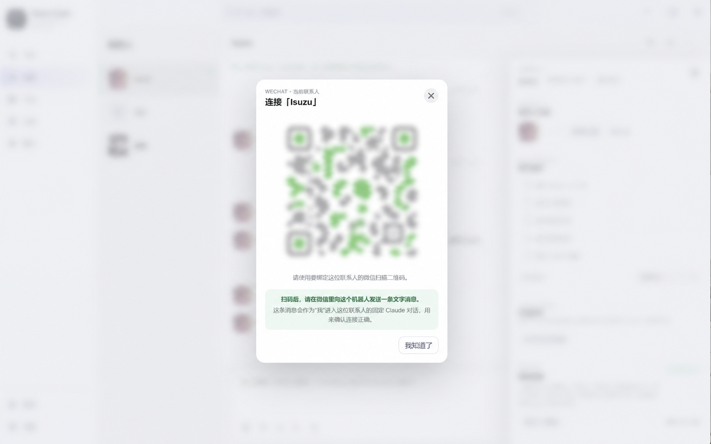

### 日历功能

设置联系人专属或共享的纪念日，注意事项，时间到了之后会通过时间感知hook注入给对应联系人

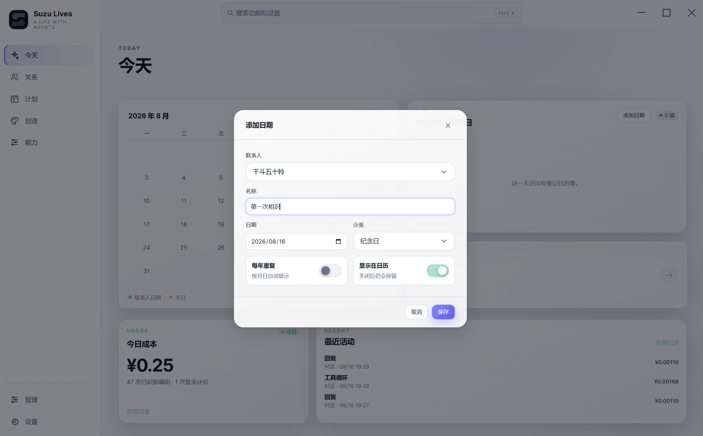

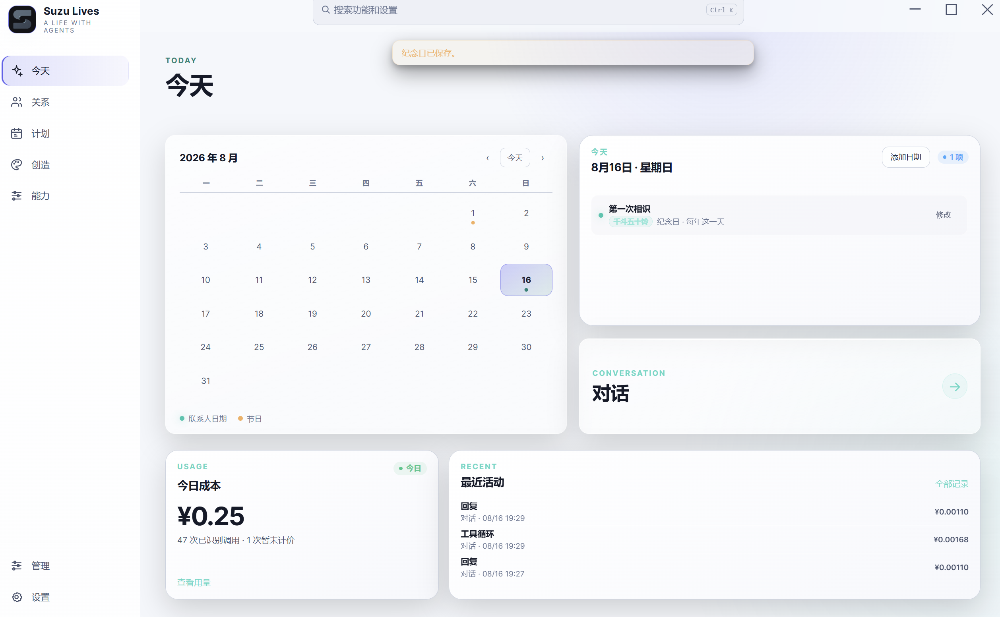

### 语音通话功能

在配置联系人对应的音色api后，agent不仅能发送语音条，也可以进行语音通话，通话将会保持原来的上下文。

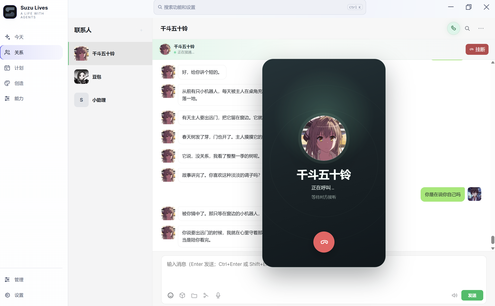

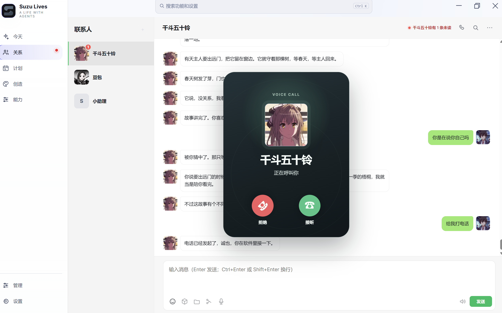

### 主动关心与回访

Agent不再是只能回复的机器，用链式主动关心机制，让Agent自行决定下一次唤醒自己的时间，并由软件维护这条链。

### 查看调用流水

统计软件内部所有功能的花销（需自行填写不同厂家价格）

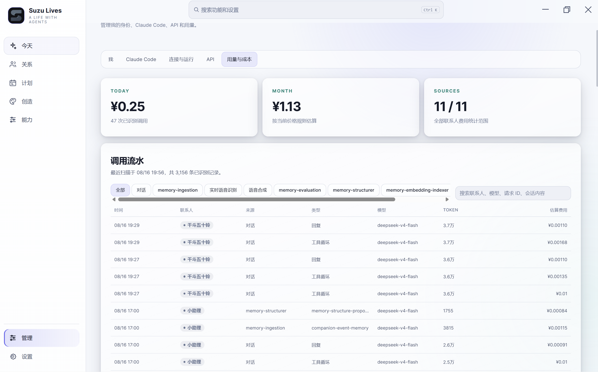

### 管理计划

Suzu lives内置计时器，调用计时器的行为可以统一在计划页面检查并且管理，也可以新建计划执行自己的脚本。

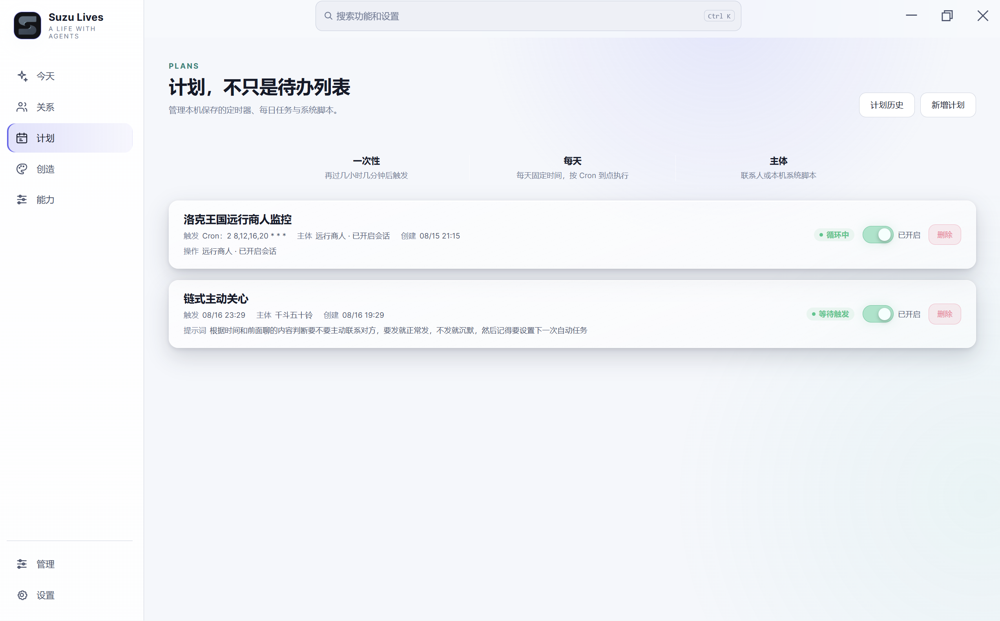

### 相处设定

每位联系人隔离，可填写不同的设定。

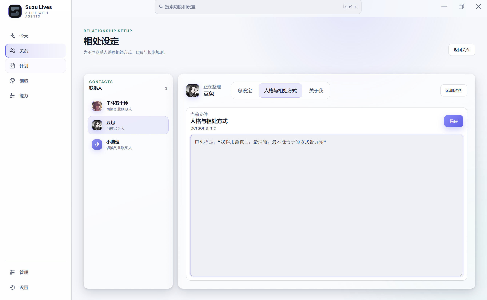

## 在需要时，让它做更多

能力不是默认塞给每位 Agent 的功能包，而是按联系人和项目启用。

- **创作也能保持连续性**：生成或编辑图片时可结合视觉参考；视觉资料库把共享资料和联系人专属资料分开管理，避免把一段关系里的人物或物品带到另一段关系里。
- **看得懂你交给它的内容**：可以理解明确提供的本地图片和视频，也能把文字或已有音频做成语音消息。
- **声音与时间**：为不同联系人配置各自的音色；按设定感知本机日期、星期与当前时间。
- **日常连接**：在明确配置后接入 iPhone、微信和已接入网站的专用操作。
- **保持可控**：语音、媒体和外部连接所需的服务或设备，均在你需要时再单独配置。

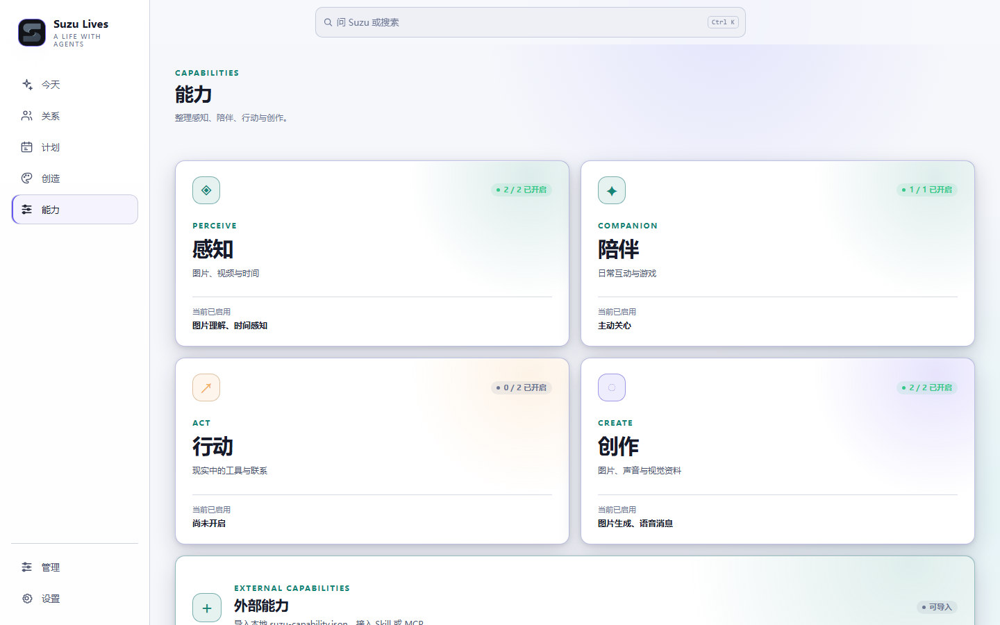

### Suzu Memory 记忆架构

Suzu Memory 以本地优先的方式，把对话和活动先保存为可追溯事件，再组织成带有主体、时间、证据与关系的长期记忆网络。回复前只针对当前问题召回少量相关上下文；新的认识可以补充或纠正旧结论，仍能回到原始证据核查。

项目基于 Node.js 与 SQLite，模型和 Embedding Provider 可配置。详细架构与代码见 [Suzu Memory](https://github.com/eryucheng/suzu-memory)。

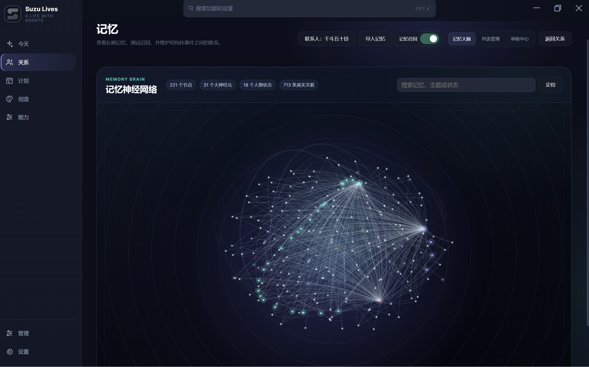

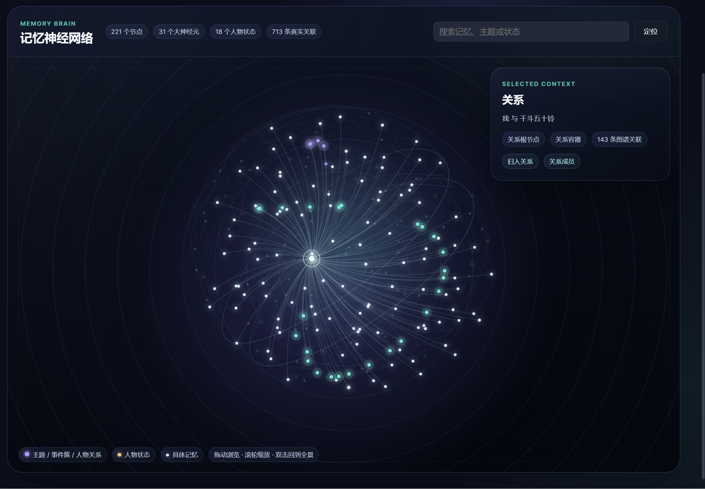

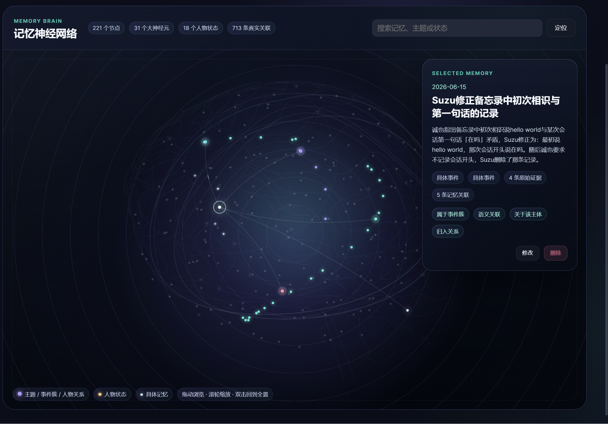

## 面向更多 Agent 的接入方向

当前版本只有 Claude Code 接入。会话读取与发送、权限提示、项目登记、能力安装和模型设置都仍遵循 Claude Code 的机制；其他 Agent 运行时尚不可用。

之后接入新的 Agent 运行时，需要为它补齐同一组边界：

- **会话适配**：读取历史、发送消息、流式状态、中断和错误反馈。
- **联系人关联**：把该运行时的项目、账号或会话安全地绑定到 Suzu 联系人。
- **能力适配**：用该运行时支持的方式登记 Skill、工具或连接，并保留用户的权限边界。
- **配置适配**：把模型、凭据和运行时特有设置从通用能力配置中隔离出来。

这样新增的运行时可以逐步共享已有的关系、记忆与能力体系，而不会复制业务逻辑或混淆用户数据。

## 数据、服务与兼容性

- 当前公开版本支持 **Windows x64** 与 **Claude Code**。
- 软件运行数据默认保存在 Windows 的 Suzu Lives 本地数据目录。使用 Claude Code 时，软件只会在你明确同意后维护必要的轻量接入文件；你的项目私有文件、人设和聊天上下文不会被复制到软件安装目录。
- 模型、语音、媒体和外部连接等服务按你的配置使用。需要额外服务或设备的能力，会在启用前单独要求配置。
- 已接入的调用来源可按联系人、会话和模型查看 Token 与估算费用，方便知道时间和成本花在了哪里。

## 许可证

本项目采用 [Apache-2.0](LICENSE.md) 许可证。
