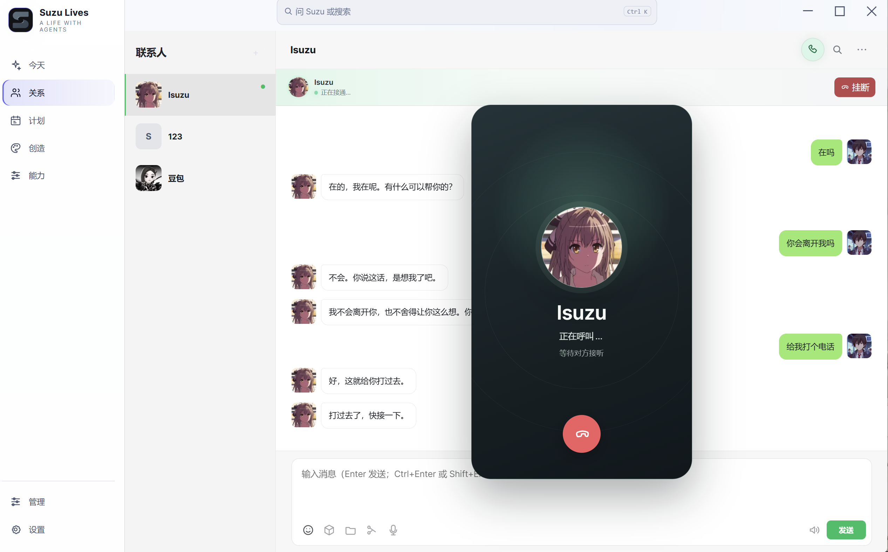

  

<h1 align="center">Suzu Lives</h1>

  <strong>A life with agents.</strong> 
  让 AI Agent 成为能长期相处的联系人。

  <a href="https://github.com/eryucheng/suzu-lives/releases/latest"><strong>下载 Windows x64 安装程序</strong></a> ·
  <a href="https://github.com/eryucheng/suzu-lives/releases">查看更新记录</a>

## 让一次次对话，变成一段持续的关系

Suzu Lives 是管理个人 Agent 联系人的桌面端：每位联系人都有独立的对话、相处设定、长期记忆、资料、头像、声音和按需启用的能力。它把本来散在会话、文件与提醒里的上下文，围绕同一个 Agent 持续积累。

当前版本由 Suzu 自己的 **Agent Core** 提供运行：联系人、相处设定、资料、会话绑定、生命周期 Hook、上下文、能力、配置与用量都由 Suzu 持有。

| 你可以做什么 | 它如何延续 |
| --- | --- |
| **和不同 Agent 分别相处** | 每位联系人保留自己的聊天、资料、声音和设定；切换联系人时不会混入另一段关系。 |
| **核对它到底记得什么** | 记忆以事件、主题、人物状态和关系组织，可查看来源、关联与最终召回结果。 |
| **不只等你先开口** | 在软件运行期间，可安排主动关心、一次性回访或每日计划；每项计划都能查看、暂停或删除。 |
| **从桌面走到日常** | 可以直接打电话，也可一键发起微信连接，让消息继续回到这位联系人的固定对话。 |
| **按联系人启用能力** | 图片、视频、语音、视觉资料、时间和邮箱通道等能力按需配置；未开启的能力不会自动加入对话。 |

## 三步开始

1. 在 Windows x64 设备上下载并安装 [最新版本](https://github.com/eryucheng/suzu-lives/releases/latest)。
2. 在首次引导或 **设置 → API** 配置主模型地址、模型名与 API Key。
3. 打开 Suzu Lives，创建联系人，然后从第一段对话开始。

## 每位 Agent，都是一段独立的关系

当对方正在处理复杂任务时，直接发送新消息即可把想法作为中途引导交给它；你也可以停止当前处理，再继续对话。当你切换到另一位 Agent 时，它们的会话、长期记忆和连接配置仍彼此独立，不会把不同关系混在一起。

## 它不只会等你先开口

开启“主动关心”后，在 Suzu Lives 运行期间，联系人可以根据此前的对话和当前时间安排后续联系：既可以持续地在合适时机问候，也可以只为“等结果”“晚点确认”这类具体事情创建一次性回访。

你也可以自己为联系人设置一次性或每天执行的计划，并随时查看、暂停或删除。软件关闭时不会偷偷执行或补跑这些任务，自动联系始终留在你看得见、能控制的范围内。

## 记得你，也让你看得见

真正的记忆不应该是一段越积越长、谁也查不清的聊天记录。Suzu Memory 会把对话中值得保留的事件、主题、人物状态和关系组织成网络；每条记忆都能关联到来源和相关内容。

你可以在记忆神经网络中拖动、缩放和搜索，也可以在记忆库查看原始证据与关联。对某个问题先运行一次“测试最终召回”，就能看到这一轮实际会带给 Agent 的记忆。错误内容可以审核、驳回或撤销，让长期记忆随关系一起维护。

## 核心功能

## 一键连接微信，手机上继续聊

在当前联系人的设置里点一次“连接微信”，就会生成专属二维码。用希望绑定的微信扫码，再按提示发出一条文字即可完成确认。

之后从微信发来的消息会进入这位联系人的固定对话，回复也会沿着同一段关系回来；多个联系人可以分别绑定，不会串到一起。

### 日历功能

设置联系人专属或共享的纪念日，注意事项，时间到了之后会通过时间感知hook注入给对应联系人

### 语音通话功能

在配置联系人对应的音色api后，agent不仅能发送语音条，也可以进行语音通话，通话将会保持原来的上下文。

### 主动关心与回访

Agent不再是只能回复的机器，用链式主动关心机制，让Agent自行决定下一次唤醒自己的时间，并由软件维护这条链。

### 查看调用流水

统计软件内部所有功能的花销（需自行填写不同厂家价格）

### 管理计划

Suzu lives内置计时器，调用计时器的行为可以统一在计划页面检查并且管理，也可以新建计划执行自己的脚本。

### 相处设定

每位联系人隔离，可填写不同的设定。

## 许可证

本项目采用 [Apache-2.0](LICENSE.md) 许可证。
