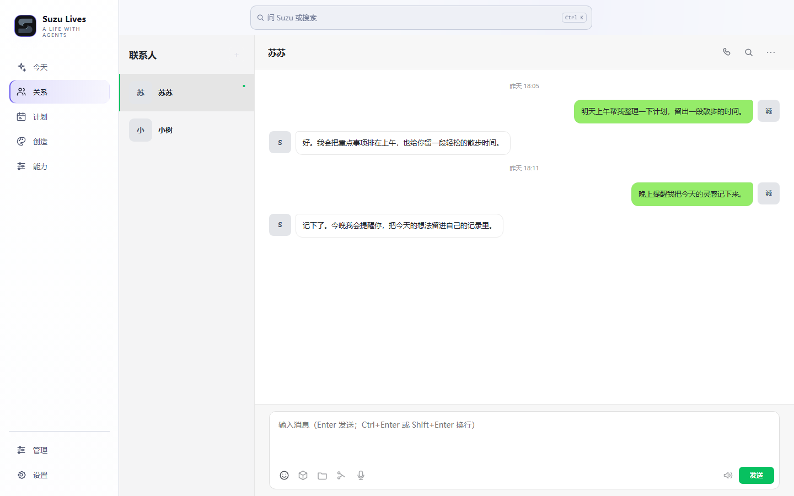

  

<h1 align="center">Suzu Lives</h1>

  <strong>A life with agents.</strong> 
  把 Claude Code 里的 Agent，从一次次对话，变成能长期相处的联系人。

  <a href="https://github.com/eryucheng/suzu-lives/releases/latest"><strong>下载 Windows 版</strong></a> ·
  <a href="https://github.com/eryucheng/suzu-lives/releases">查看更新记录</a>

Suzu Lives 为常用的 Claude Code Agent 建立一段可以继续发展的关系：每位联系人都有自己的聊天、相处设定、长期记忆与可选能力。日常对话、语音通话、资料与提醒不再散在不同窗口里，而是围绕同一个人慢慢积累。

## 记得你，也让你看得见

真正的记忆不应该是一段越积越长、谁也查不清的聊天记录。Suzu Memory 会把对话中值得保留的事件、主题、人物状态和关系组织成一张网络；每一条认识既能连接到相关记忆，也能保留它从哪里来、为什么会被记住。

你可以在记忆神经网络中拖动、缩放和搜索，顺着关系找到一件事的前因后果；也可以进入记忆库查看具体内容、原始证据与关联。对某个问题先运行一次“测试最终召回”，就能看到这一轮真正会带给 Agent 的记忆，而不是只能猜它有没有记住。错误的内容可以审核、驳回或撤销，让长期记忆随着关系一起被维护。

这让“它还记得我什么”成为一个看得见、能核对、也能修正的问题。

## 每位 Agent，都是一段独立的关系

新建联系人后，你不必每次重新挑一个人设、翻一段陌生的旧记录。对话、长期记忆、相处资料、头像和声音都会跟着这位联系人继续成长；切换到另一位 Agent 时，它们仍然彼此独立，不会把不同关系混在一起。

聊天页既适合日常地接着说，也适合回头找东西：可以按关键词、日期、图片、文件、音频或链接定位历史内容，点一下回到原消息。需要给对方资料时，直接在同一段对话里发送；需要调整相处方式时，也能在这位联系人的资料里完成，而不用离开当前关系。

## 语音通话

除了文字聊天，你也可以直接和联系人通话。既可以主动拨给对方，也可以接听对方发起的来电；通话仍延续当前会话的上下文，每位联系人也可以使用自己配置的声音。

## 主动联系与回访

Agent 可以参考此前的对话和当前时间，在合适的时候主动联系你，而不只是在收到消息后才回应。

如果你们聊到“等结果”“晚点再确认”这类有后续的事，它也可以在之后主动跟进一次。

## 按你的需要，让它做更多

不是每位 Agent 都需要同一堆功能。能力面板把它们分成创作、感知、行动和陪伴四类；先用最简单的聊天开始，需要时再为特定联系人打开对应能力。

- **看与创作**：生成或编辑图片、结合视觉参考创作，也可以理解你明确交给它的图片和视频。
- **声音与时间**：为不同联系人配置各自的音色，让文字自然变成语音消息；按设定感知本机日期、星期与时间。
- **日常连接**：在明确配置后接入 iPhone 或微信等日常入口。
- **保持可控**：能力按联系人和项目启用；你没有打开的能力不会悄悄加入对话。

这样它可以在需要时帮你看图、说话、记住时间、主动出现；不需要时，仍然只是一个安静好用的聊天窗口。

## 开始相处

1. 在电脑上安装并登录 Claude Code。
2. 下载并安装 [最新 Windows x64 版本](https://github.com/eryucheng/suzu-lives/releases/latest)。
3. 第一次打开时选择一个 Agent 工作目录，创建联系人，然后从一段聊天开始。

你不需要搬走现有项目：选择它原本的 Claude Code 工作目录即可。语音、图片和外部连接等可选能力，则在需要时再到对应页面配置自己的服务或设备。安装后的版本可在 **设置 → 软件更新** 中检查更新。

## 许可证

本项目采用 [Apache-2.0](LICENSE.md) 许可证。
